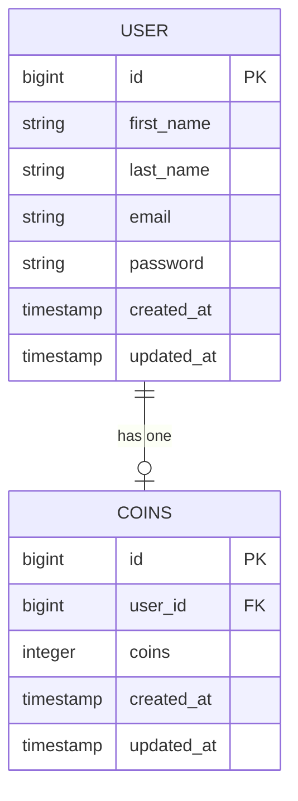

```mermaid
erDiagram
    USER ||--o| COINS : "has one"
    
    USER {
        bigint id PK
        string first_name
        string last_name
        string email
        string password
        timestamp created_at
        timestamp updated_at
    }

    COINS {
        bigint id PK
        bigint user_id FK
        integer coins
        timestamp created_at
        timestamp updated_at
    }
```